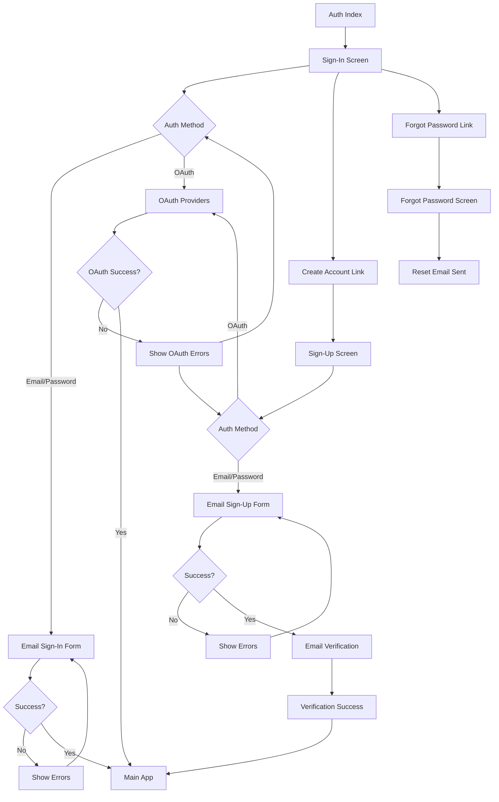
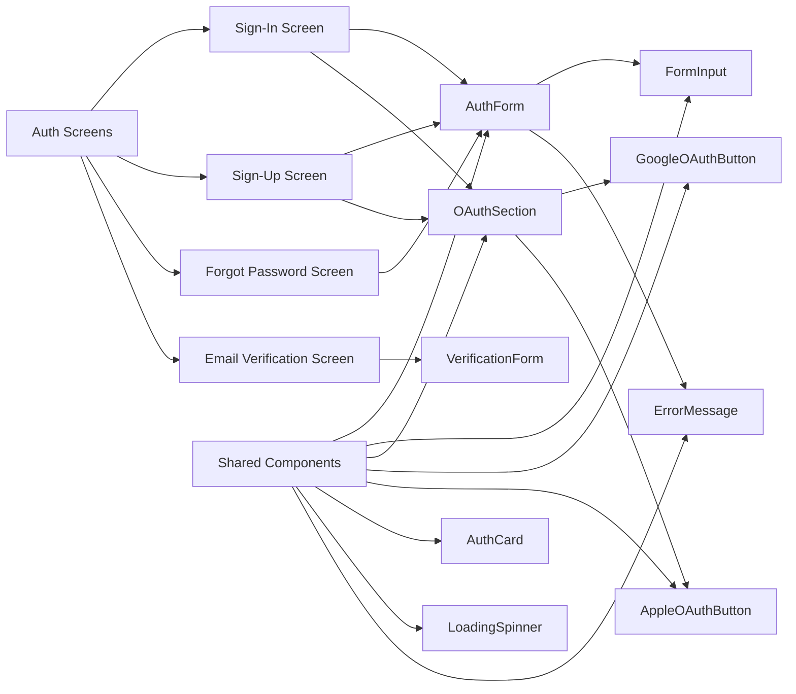

# HepatoTrack Custom Authentication Architecture

## Overview

This document outlines the comprehensive architecture and specifications for HepatoTrack's custom authentication screens, replacing the basic Clerk web components with a health-focused, custom-designed authentication system.

## Current State Analysis

### Existing Setup

- **Authentication Provider**: Clerk with proper tokenCache configuration using Expo SecureStore
- **Current Implementation**: Basic [`SignIn`](../app/(auth)/sign-in.tsx) and [`SignUp`](../app/(auth)/sign-up.tsx) web components
- **Dependencies**: `react-hook-form`, `@hookform/resolvers`, `@clerk/clerk-expo` already installed
- **Design System**: Health-focused green theming with comprehensive color palette
- **UI Components**: Robust component library with Button, Card, Text components available

### Design System Foundation

- **Primary Colors**: Health-focused green palette (`health-50` to `health-950`)
- **Liver Branding**: Specific liver health colors (`liver-light`, `liver-DEFAULT`, `liver-dark`)
- **Medical Status Colors**: Critical, warning, good, info states with light variants
- **CSS Variables**: Comprehensive design tokens in `global.css`

## Simplified Authentication Flow



## Component Architecture



## Detailed Component Specifications

### Core UI Components

#### FormInput Component

```typescript
interface FormInputProps {
  label: string;
  placeholder: string;
  value: string;
  onChangeText: (text: string) => void;
  error?: string;
  secureTextEntry?: boolean;
  keyboardType?: KeyboardTypeOptions;
  autoCapitalize?: 'none' | 'sentences' | 'words' | 'characters';
  autoComplete?: string;
  testID?: string;
  disabled?: boolean;
}
```

**Design Specifications:**

- Height: `h-12` for consistency with buttons
- Border: `border border-input` with focus state `ring-2 ring-ring`
- Background: `bg-background`
- Text: `text-base text-foreground`
- Error state: `border-medical-critical`
- Disabled state: `opacity-50`

#### AuthCard Component

```typescript
interface AuthCardProps {
  title: string;
  subtitle?: string;
  children: React.ReactNode;
  showLogo?: boolean;
}
```

**Design Specifications:**

- Background: `bg-health-50` for light mode, `bg-card` for dark mode
- Border: `border border-border`
- Shadow: `shadow-sm shadow-foreground/10`
- Padding: `p-6`
- Border radius: `rounded-lg`

#### OAuthSection Component

```typescript
interface OAuthSectionProps {
  onGooglePress: () => void;
  onApplePress: () => void;
  loading?: boolean;
  disabled?: boolean;
}
```

**Features:**

- Reusable across sign-in and sign-up screens
- Individual loading states for each provider
- Error handling for OAuth failures
- Platform-specific Apple button (iOS only)

### Screen Components

#### Sign-In Screen

**Layout:**

- AuthCard with "Welcome Back" title
- Email input field
- Password input field with show/hide toggle
- "Sign In" primary button (`bg-health-500`)
- OAuth section with Google/Apple buttons
- "Forgot Password?" link
- "Don't have an account? Create one" link

**Validation:**

- Email format validation
- Required field validation
- Display errors inline below fields on form submission

#### Sign-Up Screen

**Layout:**

- AuthCard with "Create Your Account" title
- Full name input field
- Email input field
- Confirm email input field
- "Create Account" primary button
- OAuth section with Google/Apple buttons
- Terms of service and privacy policy acceptance
- "Already have an account? Sign in" link

**Validation:**

- Name: minimum 2 characters, letters and spaces only
- Email: valid format, required
- Email confirmation: must match email
- Terms acceptance: required checkbox

#### Forgot Password Screen

**Layout:**

- AuthCard with "Reset Your Password" title
- Email input field
- "Send Reset Link" button
- Success state showing confirmation message
- Back to sign-in link

#### Email Verification Screen

**Layout:**

- AuthCard with "Verify Your Email" title
- 6-digit verification code input
- "Verify Email" button
- Resend code functionality with cooldown timer
- Back to sign-up option

## Design System Specifications

### Color Usage

- **Primary Actions**: `health-500` (#22c55e) for main CTAs
- **Secondary Actions**: `health-100` (#dcfce7) for secondary buttons
- **Success States**: `medical-good` (#16a34a)
- **Error States**: `medical-critical` (#dc2626)
- **Warning States**: `medical-warning` (#d97706)
- **Card Backgrounds**: `health-50` (#f0fdf4) for light mode
- **Text Colors**: `foreground` for primary, `muted-foreground` for secondary

### Typography Hierarchy

- **Screen Titles**: `text-3xl font-bold text-foreground`
- **Card Titles**: `text-2xl font-semibold text-card-foreground`
- **Subtitles**: `text-lg text-muted-foreground`
- **Body Text**: `text-base text-foreground`
- **Labels**: `text-sm font-medium text-foreground`
- **Error Text**: `text-sm text-medical-critical`
- **Helper Text**: `text-xs text-muted-foreground`

### Spacing & Layout

- **Screen Padding**: `px-6 py-8`
- **Card Padding**: `p-6`
- **Form Field Spacing**: `gap-y-4`
- **Button Heights**: `h-12` for primary actions, `h-10` for secondary
- **Input Heights**: `h-12` for consistency with buttons
- **Border Radius**: `rounded-lg` for cards, `rounded-md` for inputs/buttons

## Form Validation Architecture

### Enhanced Validation Schemas

```typescript
export const enhancedSignInSchema = z.object({
  email: z.string()
    .min(1, "Email is required")
    .email("Please enter a valid email address")
    .toLowerCase(),
  password: z.string()
    .min(1, "Password is required")
});

export const enhancedSignUpSchema = z.object({
  name: z.string()
    .min(1, "Full name is required")
    .min(2, "Name must be at least 2 characters")
    .regex(/^[a-zA-Z\s]+$/, "Name can only contain letters and spaces")
    .trim(),
  email: z.string()
    .min(1, "Email is required")
    .email("Please enter a valid email address")
    .toLowerCase(),
  confirmEmail: z.string()
    .min(1, "Please confirm your email address")
    .email("Please enter a valid email address")
    .toLowerCase(),
  termsAccepted: z.boolean()
    .refine(val => val === true, "You must accept the terms and conditions")
}).refine((data) => data.email === data.confirmEmail, {
  message: "Email addresses do not match",
  path: ["confirmEmail"],
});

export const forgotPasswordSchema = z.object({
  email: z.string()
    .min(1, "Email is required")
    .email("Please enter a valid email address")
    .toLowerCase(),
});

export const emailVerificationSchema = z.object({
  code: z.string()
    .min(6, "Verification code must be 6 digits")
    .max(6, "Verification code must be 6 digits")
    .regex(/^\d{6}$/, "Verification code must contain only numbers")
});
```

### Error Handling Strategy

- **Validation Timing**: Only on form submission to avoid distracting users
- **Field-level Errors**: Display below each input field with error styling
- **Form-level Errors**: Display at top of form for general errors
- **Network Errors**: Toast notifications for connectivity issues
- **Clerk Errors**: Map Clerk error codes to user-friendly messages
- **Loading States**: Disable form and show spinner during submission

## Integration Strategy with Clerk

### Custom Hook Architecture

```typescript
// useAuthForm hook for form management
interface UseAuthFormProps<T> {
  schema: ZodSchema<T>;
  onSubmit: (data: T) => Promise<void>;
  defaultValues?: Partial<T>;
}

interface UseAuthFormReturn<T> {
  register: UseFormRegister<T>;
  handleSubmit: UseFormHandleSubmit<T>;
  formState: FormState<T>;
  reset: UseFormReset<T>;
  setValue: UseFormSetValue<T>;
}

// useClerkAuth hook for Clerk integration
interface UseClerkAuthReturn {
  signIn: (email: string, password: string) => Promise<void>;
  signUp: (data: SignUpFormData) => Promise<void>;
  signInWithOAuth: (provider: 'oauth_google' | 'oauth_apple') => Promise<void>;
  resetPassword: (email: string) => Promise<void>;
  verifyEmail: (code: string) => Promise<void>;
  loading: boolean;
  error: string | null;
  clearError: () => void;
}
```

### OAuth Implementation

- Use Clerk's `useOAuth` hook with custom UI
- Provider-specific button styling and branding
- Handle OAuth redirects and error states
- Platform-specific implementation (Apple OAuth on iOS only)
- Fallback error handling for unsupported platforms

### Error Mapping

```typescript
const clerkErrorMessages: Record<string, string> = {
  'form_identifier_not_found': 'No account found with this email address',
  'form_password_incorrect': 'Incorrect password. Please try again.',
  'form_identifier_exists': 'An account with this email already exists',
  'verification_failed': 'Invalid verification code. Please try again.',
  'too_many_requests': 'Too many attempts. Please wait before trying again.',
};
```

## File Structure

```
app/(auth)/
├── index.tsx                 # Redirect to sign-in
├── sign-in.tsx              # Custom sign-in screen
├── sign-up.tsx              # Custom sign-up screen
├── forgot-password.tsx      # Forgot password screen
└── verify-email.tsx         # Email verification screen

components/auth/
├── AuthCard.tsx             # Reusable auth card wrapper
├── AuthForm.tsx             # Base form component with react-hook-form
├── FormInput.tsx            # Custom input component
├── OAuthSection.tsx         # OAuth buttons section
├── GoogleOAuthButton.tsx    # Google OAuth button
├── AppleOAuthButton.tsx     # Apple OAuth button (iOS only)
├── LoadingSpinner.tsx       # Loading indicator
├── ErrorMessage.tsx         # Error display component
└── SuccessMessage.tsx       # Success display component

hooks/auth/
├── useAuthForm.tsx          # Form management with react-hook-form
├── useClerkAuth.tsx         # Clerk integration hook
└── useAuthNavigation.tsx    # Navigation helper hook

types/
└── auth.ts                  # Enhanced auth types and schemas

utils/auth/
├── validation.ts            # Validation utilities
├── errorMapping.ts          # Clerk error message mapping
└── constants.ts             # Auth-related constants
```

## Accessibility Features

### Screen Reader Support

- Proper ARIA labels for all form elements
- Role attributes for interactive elements
- Descriptive labels for OAuth buttons
- Error announcements for screen readers

### Focus Management

- Logical tab order through forms
- Visible focus indicators
- Focus trapping in modals
- Auto-focus on first input field

### Responsive Design

- Support for system font size scaling
- High contrast mode compatibility
- Touch target sizes meet accessibility guidelines
- Keyboard navigation support

### ARIA Implementation

```typescript
// Example ARIA attributes
<TextInput
  accessibilityLabel="Email address"
  accessibilityHint="Enter your email address to sign in"
  accessibilityRole="text"
  aria-required="true"
  aria-invalid={!!errors.email}
  aria-describedby={errors.email ? "email-error" : undefined}
/>
```

## Security Considerations

### Input Security

- All inputs validated and sanitized using Zod schemas
- XSS prevention through proper input handling
- SQL injection prevention (handled by Clerk)
- Rate limiting for authentication attempts

### Session Management

- Secure token storage using Expo SecureStore
- Automatic session refresh handling
- Proper session timeout management
- Secure logout functionality

### Error Handling

- Don't expose sensitive information in error messages
- Generic error messages for security-related failures
- Proper error logging without exposing user data
- Rate limiting feedback to prevent enumeration attacks

## Performance Optimizations

### Code Splitting

- Lazy load authentication screens
- Dynamic imports for OAuth providers
- Tree-shake unused Clerk components
- Optimize bundle size for auth flows

### Caching Strategy

- Cache form validation results
- Memoize expensive computations
- Optimize re-renders with React.memo
- Cache OAuth provider configurations

### Loading States

- Skeleton loading for forms
- Progressive loading of OAuth buttons
- Debounced form submissions
- Optimistic UI updates where appropriate

## Testing Strategy

### Unit Tests

- Form validation logic testing
- Custom hook testing with React Testing Library
- Component rendering and interaction tests
- Error handling and edge case testing

### Integration Tests

- Clerk authentication flow testing
- OAuth provider integration testing
- Form submission and validation testing
- Navigation flow testing

### End-to-End Tests

- Complete authentication user journeys
- Cross-platform compatibility testing
- Accessibility testing with automated tools
- Visual regression testing

### Test Coverage Goals

- 90%+ coverage for authentication logic
- 100% coverage for validation schemas
- Integration test coverage for all user flows
- Accessibility compliance testing

## Implementation Phases

### Phase 1: Core Components

1. Create FormInput component with validation
2. Create AuthCard wrapper component
3. Implement basic form handling with react-hook-form
4. Set up enhanced validation schemas

### Phase 2: Authentication Screens

1. Implement custom Sign-In screen
2. Implement custom Sign-Up screen
3. Add Forgot Password screen
4. Add Email Verification screen

### Phase 3: OAuth Integration

1. Create reusable OAuth button components
2. Implement Google OAuth integration
3. Implement Apple OAuth integration (iOS)
4. Add OAuth error handling

### Phase 4: Polish & Testing

1. Implement loading states and animations
2. Add comprehensive error handling
3. Implement accessibility features
4. Add comprehensive test coverage

## Success Metrics

### User Experience

- Reduced authentication completion time
- Improved form validation feedback
- Higher OAuth adoption rate
- Reduced authentication errors

### Technical Metrics

- Bundle size optimization
- Performance improvements
- Accessibility compliance score
- Test coverage percentage

### Business Metrics

- User registration conversion rate
- Authentication success rate
- User retention after registration
- Support ticket reduction for auth issues

---

This architecture provides a comprehensive, scalable, and user-friendly authentication system that leverages HepatoTrack's health-focused design system while maintaining security, accessibility, and performance standards.
